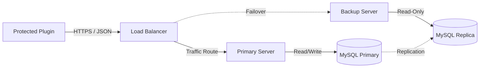

# 🛡️ Barron License Manager & Obfuscator

<div align="center">


**Enterprise-grade Java protection and license management solution.**
<br>
Build secure, time-limited, and hardware-locked distributions of your Java software.

[Report Bug](https://github.com/username/repo/issues) · [Request Feature](https://github.com/username/repo/issues)

</div>

---

## � Table of Contents
- [Overview](#-overview)
- [Key Features](#-key-features)
- [System Architecture](#-system-architecture)
- [Prerequisites](#-prerequisites)
- [Network Configuration](#-network-configuration)
- [Installation Guide](#-installation-guide)
- [Usage Workflow](#-usage-workflow)
- [Database Configuration](#-database-configuration)
- [Security Specifications](#-security-specifications)
- [Troubleshooting](#-troubleshooting)

---

## 🔭 Overview

**Barron License Manager** is a dual-purpose security suite designed for professional Java developers. It combines advanced bytecode obfuscation with a robust, server-side license verification system. 

Unlike standard obfuscators, Barron focuses on the **entire lifecycle** of software distribution:
1.  **Protect** the code using proprietary obfuscation techniques.
2.  **Lock** the software to specific hardware (IP/HWID) and timeframes.
3.  **Manage** client access via a centralized high-availability server.

---

## ✨ Key Features

| Feature Category | Description |
|------------------|-------------|
| **🛡️ Advanced Protection** | Multi-layer string encryption, control flow flattening, and aggressive identifier renaming to prevent reverse engineering. |
| **🔐 License Control** | remote license verification with support for expiration dates, IP locking (max 2 IPs), and real-time status revocation. |
| **⚖️ High Availability** | Built-in support for active-passive failover and database replication, ensuring 99.9% uptime for authentication servers. |
| **🌍 Localization** | Native support for **English**, **Turkish (Türkçe)**, and **Chinese (中文)** out of the box. |
| **⚙️ Integration Ready** | Simple drag-and-drop GUI for manual use, plus REST API endpoints for web panel integration. |

---

## � System Architecture

The system operates on a client-server model where the protected plugin acts as the client and the Barron Server acts as the authority.



---

## � Prerequisites

Before deploying the Barron License Server, ensure your environment meets the minimum requirements.

| Resource | Minimum Spec | Recommended Spec |
|:---------|:-------------|:-----------------|
| **Java Runtime** | Version 21 | Version 21 (LTS) |
| **Database** | MySQL 8.0 | MySQL 8.0+ / MariaDB |
| **Memory** | 2 GB RAM | 4 GB+ RAM |
| **Storage** | 500 MB | 1 GB SSD |
| **OS** | Windows 10 / Linux | Ubuntu 22.04 LTS / Debian 12 |

---

## 🌐 Network Configuration

> [!IMPORTANT]
> The following ports **must** be exposed for the system to function correctly. Failure to open these ports will result in connection timeouts.

| Port | Type | Direction | Purpose |
|:----:|:----:|:---------:|:--------|
| **8443** | TCP | Inbound | **License Validation API**. Used by protected plugins to verify keys. |
| **3306** | TCP | Inbound | **Database Connection**. Required only if the database is on a separate host. |
| **443**  | TCP | Outbound | **HTTPS**. Required for fetching updates or external API calls. |

### Firewall Setup Commands

<details>
<summary><strong>Windows (PowerShell)</strong></summary>

```powershell
# Open License API Port
New-NetFirewallRule -DisplayName "Barron API" -Direction Inbound -LocalPort 8443 -Protocol TCP -Action Allow

# Open MySQL Port (Optional)
New-NetFirewallRule -DisplayName "MySQL Database" -Direction Inbound -LocalPort 3306 -Protocol TCP -Action Allow
```
</details>

<details>
<summary><strong>Linux (UFW - Ubuntu/Debian)</strong></summary>

```bash
sudo ufw allow 8443/tcp comment 'Barron API'
sudo ufw allow 3306/tcp comment 'MySQL'
sudo ufw reload
```
</details>

---

## 📥 Installation Guide

### 1. Build from Source
Clone the repository and build the project using the included Gradle wrapper.

```bash
# Clone repository
git clone https://github.com/username/barron-obfuscator.git
cd barron-obfuscator

# Build JAR
./gradlew jar
```

### 2. Initial Setup
Run the application once to generate configuration files.

```bash
java -jar build/libs/Barron-Obfuscator-2.0.0.jar
```
*This will create the `config/` directory and default settings files.*

---

## 🚀 Usage Workflow

### Step 1: Database Connection
Navigate to the **Settings** tab in the GUI and configure your MySQL credentials.
*   **Host**: `localhost` (or your remote IP)
*   **Port**: `3306`
*   **Database**: `barron_licenses`

### Step 2: Obfuscation & Protection
1.  Open the **Obfuscation** tab.
2.  Drag and drop your target `.jar` file.
3.  Select **"Server-Side Mode"** to enable the licensing system.
4.  Click **Encrypt**. The output file will be saved in the `dist/` folder.

### Step 3: License Generation
1.  Go to the **License Manager** tab.
2.  Click **"Generate New License"**.
3.  Set the parameters:
    *   **Duration**: (e.g., 30 Days, Permanent)
    *   **Max IPs**: (Default: 2)
    *   **Owner Name**: Customer reference
4.  Copy the generated **License Key** (e.g., `BRN-XXXX-YYYY-ZZZZ`).

---

## 🗄 Database Configuration

For manual setup, execution of the following SQL is recommended to ensure proper permissions.

```sql
-- Create isolated database
CREATE DATABASE IF NOT EXISTS barron_licenses 
  CHARACTER SET utf8mb4 COLLATE utf8mb4_unicode_ci;

-- Create service user
CREATE USER 'barron_service'@'%' IDENTIFIED BY 'StrongPassword!2024';

-- Grant minimum necessary privileges
GRANT SELECT, INSERT, UPDATE, DELETE ON barron_licenses.* TO 'barron_service'@'%';
FLUSH PRIVILEGES;
```

---

## 🔒 Security Specifications

*   **Encryption**: Utilizes industry-standard symmetric encryption for string literals and resource files. *Specific algorithms are undisclosed for security.*
*   **Tamper Detection**: Protected JARS include self-integrity checks. Modification of the bytecode triggers an immediate shutdown.
*   **Secure Transport**: All license traffic is encrypted via HTTPS/TLS 1.3.
*   **Rate Limiting**: The API server implements leaky bucket rate limiting (default: 10 req/min per IP) to prevent brute-force attacks.

---

## ❓ Troubleshooting

| Issue | Potential Cause | Solution |
|-------|-----------------|----------|
| `Connection Refused` | Firewall blocking port 8443 | Check [Network Configuration](#-network-configuration) and ensure port 8443 is open. |
| `Key Invalid` | Wrong IP or Expired License | Verify the license status in the Web Panel. Ensure the client server IP matches the registered IP. |
| `MySQL Error` | Bind Address / User Privileges | Ensure MySQL `bind-address` is set to `0.0.0.0` for remote connections. |

---

## 🤝 Contributing

Contributions are what make the open source community such an amazing place to learn, inspire, and create. Any contributions you make are **greatly appreciated**.

1.  Fork the Project
2.  Create your Feature Branch (`git checkout -b feature/AmazingFeature`)
3.  Commit your Changes (`git commit -m 'Add some AmazingFeature'`)
4.  Push to the Branch (`git push origin feature/AmazingFeature`)
5.  Open a Pull Request

---

## 📄 License

Distributed under the MIT License. See `LICENSE` for more information.

---

<div align="center">
  <sub>Built with ❤️ by the Barron Development Team.</sub>
</div>
