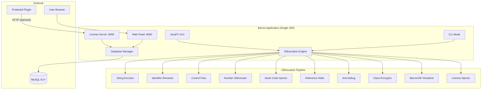
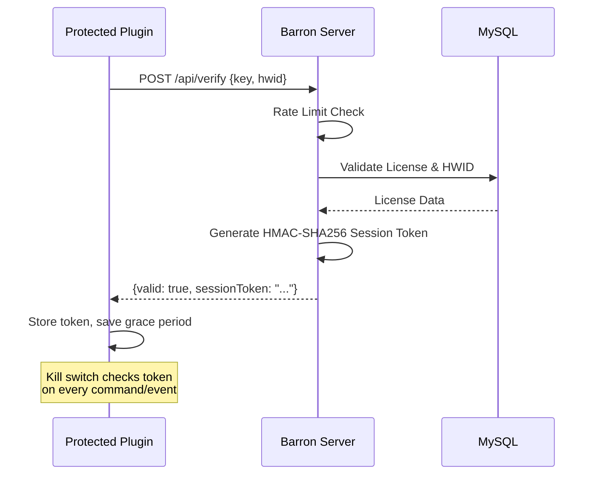

# 🛡️ Barron Obfuscator

<div align="center">


**Professional-grade Java bytecode obfuscation & license management suite.**
<br>
Protect your Minecraft plugins (and other Java applications) with multi-layered obfuscation, an embedded license server, and a full-featured web panel — all in a single JAR.

</div>

---

## 📜 Table of Contents

- [Overview](#-overview)
- [Key Features](#-key-features)
- [Obfuscation Techniques](#-obfuscation-techniques)
- [System Architecture](#-system-architecture)
- [Project Structure](#-project-structure)
- [Prerequisites](#-prerequisites)
- [Installation](#-installation)
- [Configuration](#-configuration)
- [Environment Variables](#-environment-variables)
- [Usage](#-usage)
- [BarronVM](#-barronvm)
- [API Reference](#-api-reference)
- [Network Configuration](#-network-configuration)
- [Troubleshooting](#-troubleshooting)
- [Security](#-security)
- [Contributing](#-contributing)
- [Changelog](#-changelog)
- [License](#-license)

---

## 🔭 Overview

**Barron Obfuscator** is a monolithic security suite that combines:

1. **Advanced Java Obfuscator** — Multi-layered bytecode protection (string encryption, control flow, virtualization, reference hiding, anti-debug, and more)
2. **Embedded License Server** — HTTP/HTTPS validation API for protected plugins with HWID binding, grace period, and kill switch
3. **Web Panel** — Full user dashboard, admin panel, product management, and payment integration (Stripe, Shopier, PayTR)
4. **BarronVM** — Custom bytecode virtualization engine that converts Java bytecode to a proprietary instruction set

> **One JAR, full protection.** No need for separate web servers, databases configs, or microservices. Just run Barron on your VPS and it handles everything.

---

## ✨ Key Features

| Category | Feature | Details |
|----------|---------|---------|
| 🛡️ **Obfuscation** | 10+ Transform Layers | String encryption, identifier renaming, control flow, dead code, number obfuscation, reference hiding, anti-debug, class encryption, virtualization, metadata removal |
| 🌐 **License Server** | Embedded HTTP/HTTPS | Built-in server (port 8000) with rate limiting, Cloudflare support, HWID auto-lock |
| 🖥️ **GUI** | JavaFX Desktop App | Drag & drop obfuscation, license management, real-time logs, settings |
| 💻 **CLI** | Headless/Server Mode | Auto-fallback on headless Linux, CLI key generation and obfuscation |
| 🌍 **Localization** | Multi-Language | Turkish (Türkçe), English, Chinese |
| 💳 **Payments** | 3 Providers | Stripe, Shopier, PayTR integration with webhook verification |
| 👥 **User System** | Full Auth | Registration, login, 2FA (TOTP), password reset, role-based access |
| ⚖️ **HA** | Database Replication | Active-Passive failover with real-time sync to backup server |
| 🔒 **Security** | Production-Grade | BCrypt, AES-256-GCM, HMAC-SHA256, CSRF protection, rate limiting |

---

## 🔐 Obfuscation Techniques

Barron applies the following transformations to protect your Java bytecode:

| # | Technique | Description | Configurable Level |
|---|-----------|-------------|--------------------|
| 1 | **String Encryption** | Encrypts all string literals using multi-strategy encryption (XOR, AES chain, substitution, Base64 mix) | OFF / LIGHT / MODERATE / AGGRESSIVE |
| 2 | **Identifier Renaming** | Renames classes, methods, and fields to unreadable names. Supports InvokeDynamic/Lambda references. | OFF / LIGHT / MODERATE / AGGRESSIVE |
| 3 | **Control Flow Obfuscation** | Adds opaque predicates, bogus switches, and try-catch blocks to obscure program flow | OFF / LIGHT / MODERATE / AGGRESSIVE |
| 4 | **Number Obfuscation** | Replaces numeric constants with computed expressions | OFF / LIGHT / MODERATE / AGGRESSIVE |
| 5 | **Dead Code Injection** | Injects unreachable but valid code paths to confuse decompilers | OFF / LIGHT / MODERATE / AGGRESSIVE |
| 6 | **Reference Hiding** | Hides method and field references via reflection or proxy calls | OFF / LIGHT / MODERATE / AGGRESSIVE |
| 7 | **Anti-Debug** | Detects debugger attachment, breakpoints, and agent injection at runtime | OFF / LIGHT / MODERATE / AGGRESSIVE |
| 8 | **Class Encryption** | AES-256 encrypts class files, decrypted at runtime by a custom classloader | ON / OFF |
| 9 | **Metadata Removal** | Strips source file names, line numbers, local variable tables, and annotations | ON / OFF |
| 10 | **Bytecode Virtualization** | Converts methods to BarronVM proprietary instruction set (see [BarronVM](#-barronvm)) | ON / OFF |
| 11 | **License Verification** | Injects server-side license check with kill switch, grace period, and HWID binding | ON / OFF |

---

## 🏗️ System Architecture



### Request Flow (License Verification)



---

## 📁 Project Structure

```
barron_obfuscator/
├── src/main/java/dev/barron/
│   ├── Barron.java                    # Main application class
│   ├── BarronLauncher.java            # Entry point
│   ├── api/
│   │   └── LicenseAPI.java           # Programmatic license API
│   ├── cli/
│   │   └── CliManager.java           # CLI argument handler
│   ├── config/
│   │   └── ObfuscationConfig.java    # All obfuscation settings
│   ├── db/
│   │   └── DatabaseManager.java      # MySQL operations, HikariCP pool
│   ├── gui/
│   │   └── MainWindow.java           # JavaFX GUI
│   ├── i18n/
│   │   └── I18n.java                 # Localization (TR/EN/ZH)
│   ├── license/
│   │   ├── LicenseClient.java        # Client-side license logic
│   │   ├── LicenseConfig.java        # License configuration
│   │   ├── LicenseKeyBundle.java     # Key bundle management
│   │   └── ServerAppGenerator.java   # Standalone server generator
│   ├── loader/
│   │   ├── BarronClassLoader.java    # Encrypted class loader
│   │   └── BarronPluginLauncher.java # Spigot plugin bootstrap
│   ├── obfuscator/
│   │   └── ObfuscationEngine.java    # Main obfuscation pipeline
│   ├── server/
│   │   └── LicenseServer.java        # Embedded HTTP server + Web Panel
│   ├── transformers/                  # All obfuscation transformers
│   │   ├── AntiDebug.java
│   │   ├── ClassEncryptor.java
│   │   ├── ControlFlowObfuscator.java
│   │   ├── DeadCodeInjector.java
│   │   ├── IdentifierRenamer.java
│   │   ├── LicenseCheckInjector.java
│   │   ├── MetadataRemover.java
│   │   ├── NumberObfuscator.java
│   │   ├── ReferenceHider.java
│   │   ├── StringEncryptor.java
│   │   ├── Transformer.java          # Transformer interface
│   │   ├── TransformContext.java
│   │   └── VirtualizationTransformer.java
│   └── utils/
│       ├── CryptoUtils.java          # AES-256-GCM, PBKDF2, key derivation
│       ├── JarUtils.java             # JAR read/write operations
│       ├── LibraryDetector.java      # Detect shaded libraries
│       ├── MappingGenerator.java     # Obfuscation mapping output
│       ├── NameGenerator.java        # Obfuscated name generation
│       ├── RandomizationEngine.java  # Strategy randomization per-class
│       ├── SafeClassWriter.java      # ASM ClassWriter with fallback
│       └── TotpUtil.java             # TOTP 2FA implementation
├── src/main/resources/
│   ├── styles/                        # JavaFX CSS themes
│   └── web/
│       └── index.html                # Web Panel SPA
├── BarronVM/                          # Bytecode Virtualization subproject
│   ├── build.gradle                   # Java 8+ target
│   └── src/...
├── build.gradle                       # Main project build (Java 21+)
├── settings.gradle
├── start.bat                          # Windows launcher
├── start.sh                           # Linux launcher (GUI + headless)
├── SECURITY.md                        # Security policy
├── YAPILANLAR.txt                     # Detailed changelog (Turkish)
└── LICENSE                            # MIT License
```

---

## 📋 Prerequisites

| Resource | Requirement | Notes |
|:---------|:------------|:------|
| **Java JDK** | 21+ | For building and running the application |
| **MySQL** | 8.0+ | License storage and user management |
| **OS** | Windows / Linux (Ubuntu/Debian) | macOS experimentally supported |
| **Disk** | ~200 MB | For build artifacts and dependencies |

> **Note:** The BarronVM subproject targets **Java 8+**, ensuring compatibility with all Minecraft server versions.

---

## 📥 Installation

### 1. Clone the Repository

```bash
git clone https://github.com/BarronDEV/BarronObfuscator.git
cd barron-obfuscator
```

### 2. Build the Project

```bash
# Linux/macOS
chmod +x gradlew
./gradlew jar

# Windows
gradlew.bat jar
```

The fat JAR will be created at `build/libs/Barron-Obfuscator-2.0.0.jar`.

### 3. Set Up MySQL Database

```sql
CREATE DATABASE barron_licenses;
CREATE USER 'barron'@'%' IDENTIFIED BY 'your_secure_password';
GRANT ALL PRIVILEGES ON barron_licenses.* TO 'barron'@'%';
FLUSH PRIVILEGES;
```

> Tables are automatically created on first launch.

### 4. Start the Application

**Windows:**
```powershell
.\start.bat
```

**Linux (Desktop/GUI):**
```bash
./start.sh
```

**Linux (Headless/VPS):**
```bash
./start.sh
# Automatically falls back to Server Mode if GUI unavailable
# Logs: startup.log
```

**Direct JAR:**
```bash
java -Xmx2G -jar build/libs/Barron-Obfuscator-2.0.0.jar
```

---

## ⚙️ Configuration

### GUI Configuration

On first launch, configure via the **Settings** tab:

1. **MySQL Connection** — Host, port, database, username, password
2. **Server Port** — API server port (default: 8000)
3. **Web Panel Port** — Dashboard port (default: 8080)
4. **Language** — Turkish / English / Chinese
5. **Token Secret** — Shared secret for session token signing (set a random, strong value!)
6. **SSL** — Upload PEM certificate and private key for HTTPS
7. **Backup Server** — Configure secondary MySQL host for HA replication

### Obfuscation Settings

Each transformer can be individually toggled ON/OFF and configured to a level:
- **OFF** — Disabled
- **LIGHT** — Minimal transformations
- **MODERATE** — Balanced protection/performance
- **AGGRESSIVE** — Maximum protection

---

## 🔑 Environment Variables

All environment variables are optional but **strongly recommended** for production:

| Variable | Description | Default |
|----------|-------------|---------|
| `DB_HOST` | MySQL server hostname | `localhost` |
| `DB_PORT` | MySQL server port | `3306` |
| `DB_NAME` | MySQL database name | `barron_licenses` |
| `DB_USER` | MySQL username | `barron` |
| `DB_PASS` | MySQL password | *(empty)* |
| `BARRON_ENCRYPTION_KEY` | Passphrase for AES-256-GCM encryption of payment API keys | `BarronSecureKey!` |

> [!WARNING]
> **In production:** Always set `BARRON_ENCRYPTION_KEY` to a strong, unique passphrase. The default value is public knowledge.

### Setting Environment Variables

**Linux:**
```bash
export DB_HOST=your-mysql-host
export DB_PASS=your-secure-password
export BARRON_ENCRYPTION_KEY=YourStrongRandomPassphrase123!
```

**Windows (PowerShell):**
```powershell
$env:DB_HOST = "your-mysql-host"
$env:DB_PASS = "your-secure-password"
$env:BARRON_ENCRYPTION_KEY = "YourStrongRandomPassphrase123!"
```

**Systemd Service (recommended for VPS):**
```ini
[Service]
Environment="DB_HOST=localhost"
Environment="DB_PASS=your-secure-password"
Environment="BARRON_ENCRYPTION_KEY=YourStrongRandomPassphrase123!"
ExecStart=/usr/bin/java -Xmx2G -jar /opt/barron/Barron-Obfuscator-2.0.0.jar
```

---

## 🚀 Usage

### GUI Mode (Desktop)

1. **Obfuscate:** Drag & drop JAR files → Select transformers → Click **Obfuscate**
2. **License Manager:** Create/manage licenses, view active sessions, manage IPs
3. **User Management:** Manage registered users, roles, 2FA status
4. **Products:** Create products, upload files, set prices, configure payment

### CLI Mode

```bash
# Generate a license key
java -jar Barron-Obfuscator-2.0.0.jar --gen-key --days 30

# Obfuscate a JAR file
java -jar Barron-Obfuscator-2.0.0.jar --obfuscate input.jar

# Start in server-only mode
java -jar Barron-Obfuscator-2.0.0.jar --server
```

### Web Panel

Access the user-facing web panel at `http://your-server:8080/`

Features:
- **User Registration & Login** (with 2FA support)
- **License Dashboard** — View owned licenses, manage IPs, download products
- **Product Store** — Browse products, purchase with Stripe/Shopier/PayTR or account balance
- **Admin Panel** — User management, license management, payment settings, statistics
- **Password Reset** — Email-based secure password recovery

### Plugin Configuration

After obfuscating a plugin, the end-user must add the license key to `config.yml`:

```yaml
# config.yml of the protected plugin
license-key: "XXXX-XXXX-XXXX-XXXX"
```

The plugin will automatically verify against your Barron server on startup.

---

## 🖥️ BarronVM

**BarronVM** is a lightweight, embeddable virtual machine that acts as an additional obfuscation layer:

- Converts Java bytecode methods into a **proprietary instruction set** (BarronCode)
- Runtime interpretation by a stack-based virtual CPU
- Renders standard decompilers (JD-GUI, Recaf, FernFlower) ineffective
- **Java 8+ compatible** — works on all Minecraft server versions
- Ultra-lightweight (< 5 KB compiled)

BarronVM is built as a Gradle subproject and automatically embedded into obfuscated JARs.

```java
// How BarronVM works internally
BarronVM.exec(bytecodeArray, localVariables);
```

---

## 📡 API Reference

### License Verification API

**Base URL:** `http://your-server:8000`

#### `POST /api/verify`

Validates a license key.

**Request Body:**
```json
{
  "key": "XXXX-XXXX-XXXX-XXXX",
  "hwid": "base64-encoded-hardware-hash"
}
```

**Success Response (200):**
```json
{
  "valid": true,
  "message": "License valid",
  "timestamp": 1713740000000,
  "sessionToken": "hmac-sha256-signed-token"
}
```

**Invalid License (200):**
```json
{
  "valid": false,
  "message": "Invalid license or IP"
}
```

**Rate Limited (429):**
```json
{
  "error": "Too many requests. Try again later."
}
```

### Web Panel API

**Base URL:** `http://your-server:8080`

| Endpoint | Method | Auth | Description |
|----------|--------|------|-------------|
| `/api/auth/login` | POST | ❌ | User login (with 2FA support) |
| `/api/auth/register` | POST | ❌ | User registration |
| `/api/auth/logout` | POST | ✅ | End session |
| `/api/auth/forgot-password` | POST | ❌ | Request password reset |
| `/api/auth/reset-password` | POST | ❌ | Reset password with token |
| `/api/auth/2fa/*` | POST | ✅ | 2FA setup/enable/disable |
| `/api/user/profile` | GET/POST | ✅ | View/update profile |
| `/api/user/licenses` | GET | ✅ | List owned licenses |
| `/api/user/licenses/add` | POST | ✅ | Bind license to account |
| `/api/products` | GET | ❌ | List available products |
| `/api/admin/*` | GET/POST | ✅🔑 | Admin panel operations |
| `/api/payment/*` | POST | ✅ | Payment processing |

---

## 🌐 Network Configuration

> [!IMPORTANT]
> The following ports must be open for the application to function:

| Port | Protocol | Usage | Configurable |
|:----:|:--------:|:------|:------------:|
| **8000** | TCP | License Validation API | ✅ Yes (GUI) |
| **8080** | TCP | Web Panel (Dashboard) | ✅ Yes (GUI) |
| **3306** | TCP | MySQL Database | ❌ (MySQL config) |

### Firewall Setup (Linux/UFW)

```bash
sudo ufw allow 8000/tcp comment 'Barron License API'
sudo ufw allow 8080/tcp comment 'Barron Web Panel'
sudo ufw reload
```

### Cloudflare Setup (Recommended)

Barron supports Cloudflare proxying out of the box:
- Reads `CF-Connecting-IP` and `X-Forwarded-For` headers for real client IP
- Configure your domain to proxy through Cloudflare
- Set the **Server Domain** in GUI settings for proper CORS

---

## ❓ Troubleshooting

| Issue | Solution |
|-------|----------|
| **Client can't connect** | Ensure port 8000 is open. Check console for `[LicenseServer] Listening on port 8000`. |
| **Port in use** | Change port in **Settings > Network** or kill the conflicting process. |
| **GUI won't open on Linux** | Expected on headless servers. App auto-switches to Server Mode. Check `startup.log`. |
| **MySQL connection failed** | Verify credentials, ensure MySQL is running, check firewall allows port 3306. |
| **License shows invalid** | Check: (1) correct license key in `config.yml`, (2) server is reachable, (3) license not expired, (4) IP limit not exceeded. |
| **Build fails** | Ensure JDK 21+ is installed. Run `java -version` to verify. |
| **IllegalPluginAccessException** | This was fixed in v2.0.0. Ensure you're using the latest build. |
| **NoClassDefFoundError (Lambda)** | This was fixed in v2.0.0. Lambda/Stream references are now properly updated during renaming. |

---

## 🔒 Security

See [SECURITY.md](SECURITY.md) for:
- Complete list of security features
- Environment variable reference
- Vulnerability reporting guidelines
- Deployment best practices

### Quick Security Checklist for Production

- [ ] Set `BARRON_ENCRYPTION_KEY` environment variable
- [ ] Set `DB_PASS` environment variable
- [ ] Use HTTPS (SSL certificates in GUI settings or behind Cloudflare)
- [ ] Set a strong **Token Secret** in GUI settings
- [ ] Set proper **Server Domain** for CORS restriction
- [ ] Enable 2FA for admin accounts
- [ ] Configure firewall (only expose ports 8000, 8080)
- [ ] Set up database replication for HA

---

## 🤝 Contributing

Contributions are welcome! Please follow these guidelines:

1. **Fork** the repository
2. **Create** a feature branch (`git checkout -b feature/amazing-feature`)
3. **Commit** your changes (`git commit -m 'Add amazing feature'`)
4. **Push** to the branch (`git push origin feature/amazing-feature`)
5. **Open** a Pull Request

### Development Setup

```bash
# Clone and build
git clone https://github.com/yourusername/barron-obfuscator.git
cd barron-obfuscator
./gradlew jar

# Run in development
java -jar build/libs/Barron-Obfuscator-2.0.0.jar
```

### Code Style
- Java 21+ features (records, text blocks, pattern matching)
- UTF-8 encoding
- 4-space indentation (no tabs)

---

## 📝 Changelog

See [YAPILANLAR.txt](YAPILANLAR.txt) for a detailed, chronological list of all changes, bug fixes, and security improvements.

### Recent Highlights (v2.0.0)
- ✅ AES-256-GCM encryption for payment API keys (replaced weak XOR)
- ✅ Kill switch token format fix (HMAC mismatch resolved)
- ✅ Backup server `valid:true` verification (prevents bypass)
- ✅ 2FA secret leak prevention
- ✅ Debug log sanitization
- ✅ CORS and CSRF hardening
- ✅ Shopier webhook HMAC signature verification
- ✅ JDK 21-25+ compatibility (BarronVM targets Java 8+)
- ✅ Lambda/InvokeDynamic reference tracking during renaming
- ✅ HikariCP connection pooling

---

## 📄 License

This project is licensed under the **MIT License** — see the [LICENSE](LICENSE) file for details.

---

<div align="center">
  <sub>Built with ❤️ by the Barron Development Team</sub>
</div>
